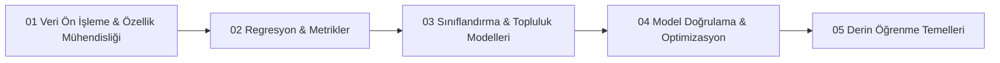

# Zamanında Buralardan Başladık: Temel Makine Öğrenmesi Yolculuğu

Her kapsamlı yapay zeka mühendisliği serüveni, makine öğrenmesi algoritmalarının ve veri bilimi hatlarının (pipeline) temel yapı taşlarını adım adım inşa ederek başlar. Bu repository; tekil fonksiyon denemelerinden, özellik mühendisliği adımlarından ve temel algoritma kıyaslamalarından oluşan erken dönem makine öğrenmesi çalışmalarını düzenli, şablonlu ve modüler bir vitrin altında toplamaktadır.

---

## Öğrenme Müfredatı ve Modül Haritası

---

## Modül Dizini ve İçerik Tablosu

| Bölüm | Konu / Algoritma | Veri Seti | Temel Yöntem & Kütüphane | Konum |
|:---|:---|:---|:---|:---|
| **01 Ön İşleme** | One-Hot Encoding | Churn Modelling | `OneHotEncoder`, `pd.get_dummies` | `01-veri-on-isleme-ve-ozellik-muhendisligi/01-one-hot-encoding-churn/` |
| **01 Ön İşleme** | Metin Vektörizasyonu | Metin Koleksiyonu | `CountVectorizer`, n-gram, DTM | `01-veri-on-isleme-ve-ozellik-muhendisligi/02-count-vectorizer-metin-analizi/` |
| **01 Ön İşleme** | Özellik Ölçeklendirme | Sayısal Öznitelikler | `StandardScaler`, `MinMaxScaler`, `RobustScaler` | `01-veri-on-isleme-ve-ozellik-muhendisligi/03-ozellik-olceklendirme-ve-normalizasyon/` |
| **02 Regresyon** | Regresyon Hata Metrikleri | Insurance Charges | MAE, MSE, RMSE, MAPE Analizi | `02-regresyon-modelleri-ve-hata-metrikleri/01-regresyon-metrikleri-mae-mse-mape/` |
| **02 Regresyon** | Random Forest Regressor | Insurance Charges | `RandomForestRegressor`, `n_estimators` | `02-regresyon-modelleri-ve-hata-metrikleri/02-random-forest-regresyonu/` |
| **02 Regresyon** | Train-Test Ayrımı Deneyi | Audi Vehicle Pricing | Veri Sızıntısı (Data Leakage) Kıyaslaması | `02-regresyon-modelleri-ve-hata-metrikleri/03-train-test-ayrimi-kiyaslamasi/` |
| **03 Sınıflandırma** | Lojistik Regresyon | UCI Benchmark | Sigmoid, Karar Eşiği, ROC-AUC | `03-siniflandirma-algoritmalari-ve-karsilastirma/01-lojistik-regresyon-uci/` |
| **03 Sınıflandırma** | Ağaç ve Topluluk Kıyası | Sınıflandırma Verisi | DecisionTree vs RandomForest vs XGBoost | `03-siniflandirma-algoritmalari-ve-karsilastirma/02-karar-agaclari-rf-ve-xgboost/` |
| **03 Sınıflandırma** | Kaggle Titanic Analizi | Titanic Passengers | EDA, Eksik Veri Tamamlama, Sınıflandırma | `03-siniflandirma-algoritmalari-ve-karsilastirma/03-titanic-hayatta-kalma-analizi/` |
| **04 Doğrulama** | Aşırı ve Yetersiz Öğrenme | Polinomik Veri | Bias-Variance Tradeoff, Düzenlileştirme | `04-model-dogrulama-ve-optimizasyon/01-asiri-ve-yetersiz-ogrenme-bias-variance/` |
| **04 Doğrulama** | K-Katlı Çapraz Doğrulama | Airline Customer Bookings | `cross_val_score`, K-Fold Stratejileri | `04-model-dogrulama-ve-optimizasyon/02-capraz-dogrulama-cross-val-score/` |
| **05 Derin Öğrenme** | Keras Sequential API | Sayısal Öznitelikler | Dense Katmanları, ReLU, Adam | `05-derin-ogrenme-temelleri/01-keras-sequential-mimarisi/` |
| **05 Derin Öğrenme** | Çok Sınıflı Anemi Tespiti | Hematolojik Kan Verisi | Softmax, Categorical Cross-Entropy | `05-derin-ogrenme-temelleri/02-anemi-tipi-cok-sinifli-softmax/` |
| **06 Denetimsiz** | K-Means & PCA | Çok Boyutlu Sentetik Kümeler | `KMeans`, `PCA`, Siluet Skoru | `06-denetimsiz-ogrenme-ve-boyut-indirgeme/` |
| **07 Optimizasyon**| Hiperparametre Arama | Breast Cancer Benchmark | `GridSearchCV` vs `Optuna` (TPE) | `07-otomatik-hiperparametre-optimizasyonu/` |
| **08 Dengesiz Veri**| Sınıf Dengesizliği | Dengesiz Sınıflandırma (%95/%5)| `SMOTE`, `class_weight='balanced'` | `08-dengesiz-veri-kumeleriyle-calisma/` |

---

## 1. Veri Ön İşleme ve Özellik Mühendisliği

Ham verilerin makine öğrenmesi modelleri tarafından işlenebilir matris formuna getirilmesi:
- **Kategorik Kodlama:** Kardinalitesi yüksek ve düşük kategorik değişkenlerin model girdisine dönüştürülmesinde `OneHotEncoder` kullanımı ve kukla değişken tuzağının (dummy variable trap) yönetimi.
- **Metin Vektörizasyonu:** NLP alanında kelime dağarcığı oluşturma, n-gram pencereleri ve seyrek (sparse) matris gösterimi.
- **Ölçeklendirme:** Gradient tabanlı ve mesafe tabanlı (KNN, SVM vb.) algoritmaların hassas olduğu varyans uyumsuzluklarının giderilmesi.

---

## 2. Regresyon Modelleri ve Hata Analizi

Sürekli hedef değişkenlerin tahmininde hata fonksiyonlarının matematiksel davranışı:
- **Hata Metrikleri:**
  $$\text{MAE} = \frac{1}{n} \sum_{i=1}^n |y_i - \hat{y}_i|$$
  $$\text{MSE} = \frac{1}{n} \sum_{i=1}^n (y_i - \hat{y}_i)^2$$
  $$\text{RMSE} = \sqrt{\text{MSE}}$$
  $$\text{MAPE} = \frac{100\%}{n} \sum_{i=1}^n \left|\frac{y_i - \hat{y}_i}{y_i}\right|$$
- **Audi Train-Test Deneyi:** Eğitilen modelin eğitim verisi üzerindeki performansı ile daha önce görmediği test verisi üzerindeki performansı arasındaki genelleme farkının ampirik ispatı.

---

## 3. Sınıflandırma ve Topluluk (Ensemble) Modelleri

İkili ve çoklu sınıflandırma problemlerinde karar sınırlarının çizilmesi:
- **Lojistik Regresyon:** Olasılıksal çıktı dönüşümü ve karar eşiği analizi.
- **Karar Ağacı vs. Random Forest vs. XGBoost:** Tekil ağacın yüksek varyans riski, bagging yaklaşımı ile varyansın düşürülmesi ve boosting yaklaşımı ile ardışık hata düzeltme performansı.
- **Titanic Analizi:** Veri bilimi projelerinde eksik veri analizi, aykırı değer temizliği ve öznitelik türetimi (Feature Engineering).

---

## 4. Model Doğrulama ve Genelleme

- **Bias-Variance Dengesi:** Yetersiz öğrenme (Underfitting) durumundaki yüksek yanlılık ile aşırı öğrenme (Overfitting) durumundaki yüksek varyans arasındaki optimum model karmaşıklığı noktasının tespiti.
- **K-Katlı Çapraz Doğrulama:** Veri setinin $k$ eşit parçaya bölünerek her parçanın dönüşümlü olarak test verisi yapılması ve model kararlılığının ölçülmesi.

---

## 5. Derin Öğrenmeye Giriş

- **Keras Sequential Mimarisi:** İleri beslemeli yapay sinir ağlarında (ANN) katman mimarisi, gizli katman sayısı ve aktivasyon fonksiyonlarının rolü.
- **Çok Sınıflı Softmax:**
  $$\sigma(z)_i = \frac{e^{z_i}}{\sum_{j=1}^K e^{z_j}}$$
  Hematolojik veriler üzerinde çok sınıflı olasılık dağılımının optimizasyonu.

---

## Yol Haritası Gelişim Durumu (8/8 Bölüm Tamamlandı)

Tüm temel ve ileri düzey makine öğrenmesi aşamaları eksiksiz olarak kodlanmış ve doğrulanmıştır:
- [x] **Bölüm 01:** Veri Ön İşleme ve Özellik Mühendisliği (Encoding, Vectorization, Scaling)
- [x] **Bölüm 02:** Regresyon Modelleri ve Hata Analizi (MAE/MSE/RMSE, Random Forest, Audi Train-Test Split)
- [x] **Bölüm 03:** Sınıflandırma ve Topluluk Modelleri (Logistic Regression, Decision Tree, RF, XGBoost, Titanic EDA)
- [x] **Bölüm 04:** Model Doğrulama ve Genelleme (Bias-Variance Tradeoff, K-Fold cross_val_score)
- [x] **Bölüm 05:** Derin Öğrenmeye Giriş (Keras Sequential API, Multiclass Softmax)
- [x] **Bölüm 06:** Denetimsiz Öğrenme ve Boyut İndirgeme (K-Means Kümeleme, Dirsek Yöntemi ve PCA)
- [x] **Bölüm 07:** Otomatik Hiperparametre Optimizasyonu (GridSearchCV, RandomizedSearchCV ve Optuna Entegrasyonu)
- [x] **Bölüm 08:** Dengesiz Veri Kümeleri ile Çalışma (SMOTE ile Yeniden Örnekleme ve Class Weight Dengelemesi)

---

## Amaç ve Vizyon

Bu derleme, yapay zeka ve yazılım mühendisliği kariyerinin erken evrelerinde atılan adımları, kazanılan metodolojik disiplini ve temel veri bilimi kavramlarına olan hakimiyeti sergileyen açık kaynak bir eğitim ve referans vitrinidir.
